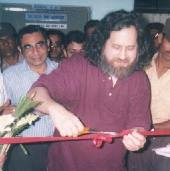
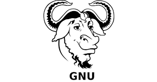
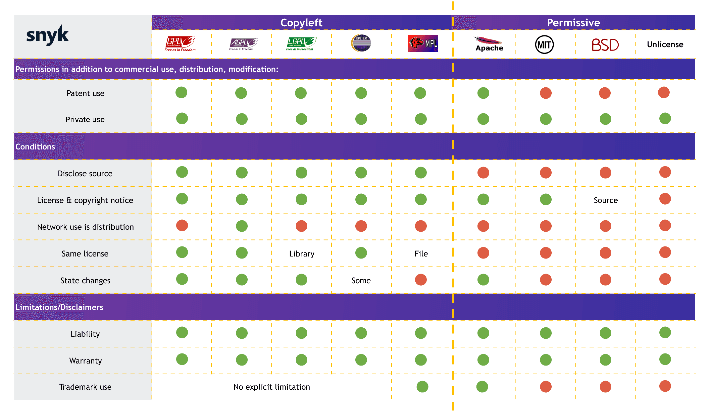
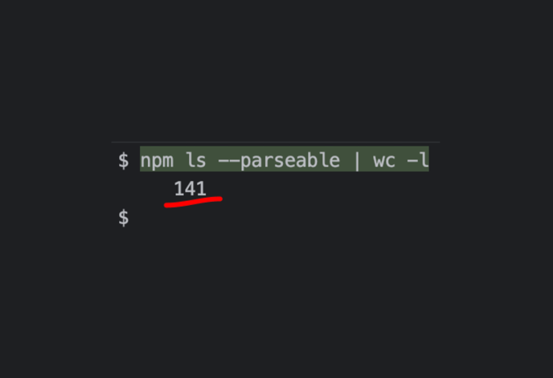
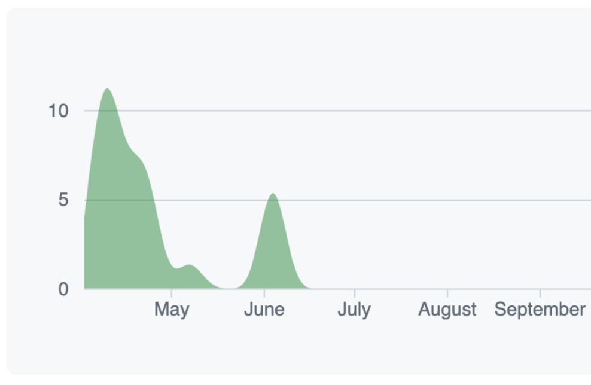
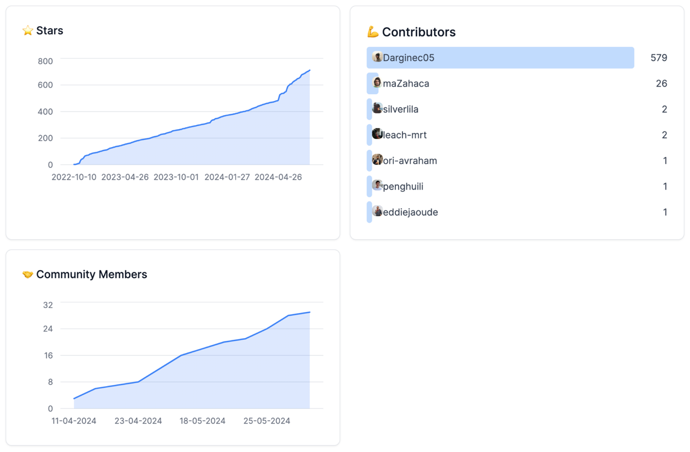
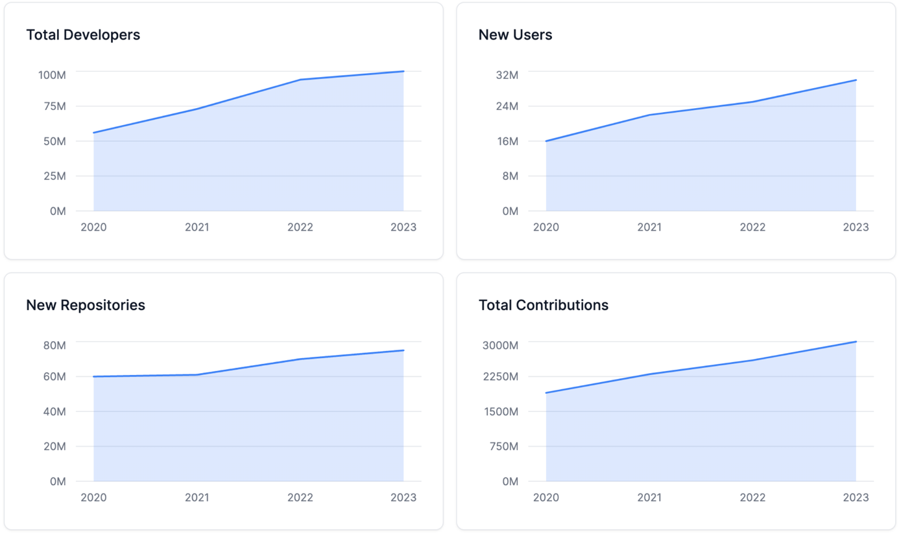

# Open source - Free software: what it is (and what it’s not)

## Evolution of Open source and free software

### Early days of free software

> "Can you fix my printer?" is a joke every developer should know or be asked at least once in their life.

This is how the story of **Richard Stallman** and free software movement begins.
In the late 1970s and early 1980s, the hacker culture that **Stallman** thrived on began to fragment.
To prevent software from being used on their competitors' computers, most manufacturers stopped distributing source code and began using copyright and restrictive software licenses to limit or prohibit copying and redistribution.
Such proprietary software had existed before, and it became apparent that it would become the norm.
This shift in the legal characteristics of software was a consequence triggered by the **US Copyright Act** of 1976.

In **1980**, Stallman and some other hackers at the AI Lab were refused access to the source code for the software of a newly installed laser printer, the Xerox 9700.
Stallman had modified the software for the Lab's previous laser printer (the XGP, Xerographic Printer), so it electronically messaged a user when the person's job was printed, and would message all logged-in users waiting for print jobs if the printer was jammed. Not being able to add these features to the new printer was a major inconvenience, as the printer was on a different floor from most of the users.
This experience convinced Stallman of people's need to be able to freely modify the software they use.

### Birth of the GNU Project

Stallman announced the plan for the GNU operating system in September 1983.
In 1985, Stallman published the GNU Manifesto, which outlined his motivation for creating a free operating system called GNU, which would be compatible with Unix.
The name GNU is a recursive acronym for "GNU's Not Unix".
Soon after, he started a nonprofit corporation called the Free Software Foundation to employ free software programmers and provide a legal infrastructure for the free software movement.
Stallman popularized the concept of **copyleft**, a legal mechanism to protect the modification and redistribution rights for free software.
It was first implemented in the GNU Emacs General Public License, and in 1989 the first program-independent GNU General Public License (GPL) was released.
Later components developed in GNU was used together with Linux kernel, forming the GNU/Linux operating system.

**Key notes:**
- **1983**: Richard Stallman announces the GNU Project.
- Motivation: Create a free Unix-like operating system
- **The GNU Manifesto (1985)**
  - Emphasis on freedom to modify and share software.
  - Opposition to proprietary software's restrictions.
  - Encouragement of a cooperative programming community
- GNU/Linux: Combination of GNU components and the Linux kernel creates a complete free operating system

### GNU GPL Principles

- Freedom to run the program for any purpose.
- Freedom to study and modify the program.
- Freedom to redistribute copies.
- Freedom to distribute modified versions.

For all copies the license should be kept as GPL.

### Open Source Initiative

In 1998, a group of individuals, dissatisfied with the term "free software", gathered to discuss the need for a new term that would appeal to business executives and software developers.
The term "open source" was coined at a strategy session held at the VA Research offices in Mountain View, California.
The Open Source Initiative (OSI) was founded in February 1998 to promote and protect open source software.
The OSI's mission is to educate about and advocate for the benefits of open source and to build bridges among different constituencies in the open source community.

## Is open source == FREE?
Open source software is not always free, but it is generally available at no cost.
The term "free" in open source refers to the freedom to use, modify, and distribute the software, not to its price.

## Values of Open Source
**Transparency:** Open source software makes its source code available for anyone to view, understand, and verify.
**Collaboration:** Open source projects thrive on collaborative contributions from a diverse community of developers. This collective effort results in more innovative, robust, and high-quality software.
**Freedom:** Users of open source software have the freedom to use, modify, and distribute the software.
**Community:** A vibrant community forms around open source projects, providing support, sharing knowledge, and driving the software's development and improvement through collective effort.
**Security:** The open nature of the code allows many developers to review, identify, and fix vulnerabilities quickly.
**Cost-effectiveness:** Open source software is generally free to use, reducing or eliminating the costs associated with licensing fees.

### Open Source Licenses
Open source license is a legal agreement that define the terms under which software can be used, modified, and distributed.
These licenses grant users the freedom to use, modify, and distribute the software while ensuring that the software remains open source.
Some of the most popular open source licenses include the GNU General Public License (GPL), the Apache License, and the MIT License.

## Types of OSS Licenses

**Copyleft Licenses:**
  - Require derived works to be distributed under the same license terms.
  - Aim to ensure software remains free and open.
  - Example: GNU General Public License (GPL).

**Permissive Licenses:**
  - Allow more flexibility in how software can be used and redistributed.
  - Permits proprietary use of the code.
  - Examples: MIT License, Apache License 2.0

Examples of OS Licenses battles:
1. **ReactJS by Facebook**
This was moving from Apache to BSD + Patents. This was a big deal because Facebook was trying to protect itself from patent trolls.
However, after a lot of backlash, they moved it to MIT license.

2. **Terraform by HashiCorp**
After 9 years of being open source (MPL license), they decided to move to a new license called the HashiCorp Community License - BSL.
A huge criticism was that it was not OSI approved. Many people started to remove their code from the repository, as they contributed to Open Source but not BSL.
As a result a group of volunteers forked the project and created a new one called OpenTofu.

### Choosing the Right License
**Project Goals:** Determine whether to enforce open source (copyleft) or allow proprietary use (permissive).
**Community and Ecosystem:** Consider the norms and expectations of the project's community.
**Legal Requirements:** Understand the legal implications and compliance needs.

### We use open source
even though we don't know it

**Package Managers** - unlock the speed we use OSS to build our products
- pip install (Python)
- npm install (JavaScript)
- go get (Golang)
- brew install (MacOS)

### The Role of Community in Open Source
- **Collaboration and Contribution**
  - **Collective Development:** Open source projects rely on contributions from a wide range of developers. Community members can submit code, report bugs, suggest features, and improve documentation.
  - **Diverse Perspectives:** Community brings together individuals with different skills, backgrounds, and perspectives, leading to innovative solutions

- **Support and Mentorship**
  - **Knowledge Sharing:** Community forums, mailing lists, and chat groups are common in open source projects
  - **Mentorship Programs:** Many open source projects have mentorship programs that help new contributors get started and grow their skills.

- **Quality Assurance**
  - **Peer Review:** Contributions are often reviewed by multiple community members, ensuring high-quality code and reducing the likelihood of bugs.
  - **Testing and Feedback:** A large user base provides extensive testing and feedback, helping to identify and fix issues quickly.

- **Sustainability**
  - **Continued Development:** A strong community can sustain a project over the long term, even if the original developers move on. Community members can take over maintenance and continue development.
  - **Funding and Resources:** Community-driven fundraising, sponsorships, and donations can provide the financial resources needed to support ongoing development.

## Examples

### Private Source Project

Recently, I worked on a private project—a Telegram Journaling Application solo. The work lasted three months while we looked for funding. Unfortunately, we didn’t get to the point in six months, and I personally burned out with no output. The project was closed.

### Open Source Project
On another side with open source.

3 months ago, I joined an amazing Open Source project: [Yoopta Editor](https://github.com/Darginec05/Yoopta-Editor).
This is a highly extensible Notion-like WYSIWYG Editor. Basically, it’s Notion available in Open Source, where you can integrate it into your application as a text editor. During this time, we started to speak about it, also investing some time into publications on Reddit, HackerNews, and others. Also, we contributed a lot of time to documentation, contribution guides, configuration CI/CD, and forming the community in Telegram.
Here are some metrics we achieved for the last 1.5 months:
- The number of stars increased by 35%.
- 6 new contributors joined the project and started actively working on it.
- The Developer Community has grown to 30 members.
- 5 Big SaaS projects started to use our open-source project.
- 3 sponsor, contributing $10/month
- Applied to YCombinator, but got rejected.

### GitHub Reports on Open Source

- **Steady Growth:** There is a consistent increase in the number of developers, new users, and new repositories on GitHub from 2020 to 2023.
- **Developer Engagement:** The total contributions, indicating active participation and collaboration, have shown a significant upward trend.
- **Impact of Remote Work:** The surge in contributions during the pandemic years reflects increased engagement in open-source projects as developers adapted to remote work.

### Thoughts

> “We know open source is a recipe for innovation”
> 
> Rishi Sunak

## Resources
- [History](https://en.wikipedia.org/wiki/Open-source-software_movement#:~:text=The%20open%2Dsource%20movement%20is,source%20code%20for%20software%20development.)
- [Open Source Initiative](https://opensource.org/)
- [Open Source Definition](https://opensource.org/osd)
- [Free Software Foundation](https://en.wikipedia.org/wiki/Free_Software_Foundation)
- [GNU Project](https://www.gnu.org/home.en.html)
- [Linux Foundation](https://www.linuxfoundation.org/)
